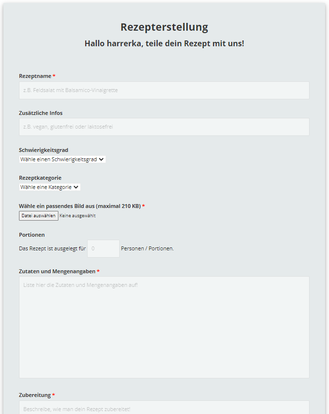
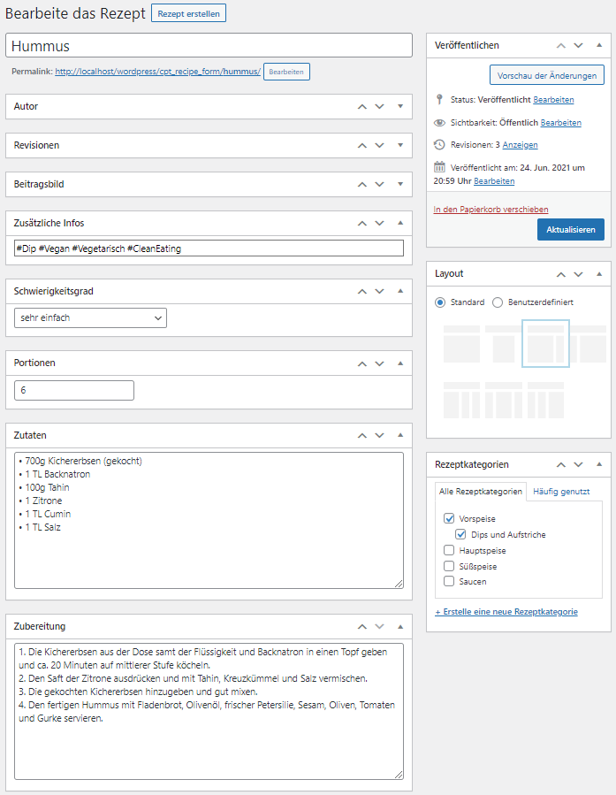
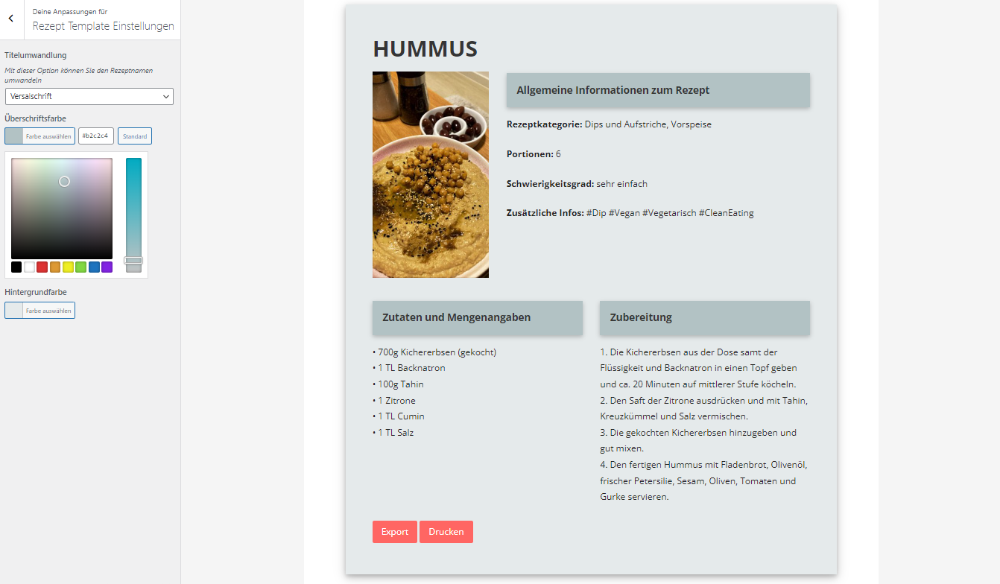
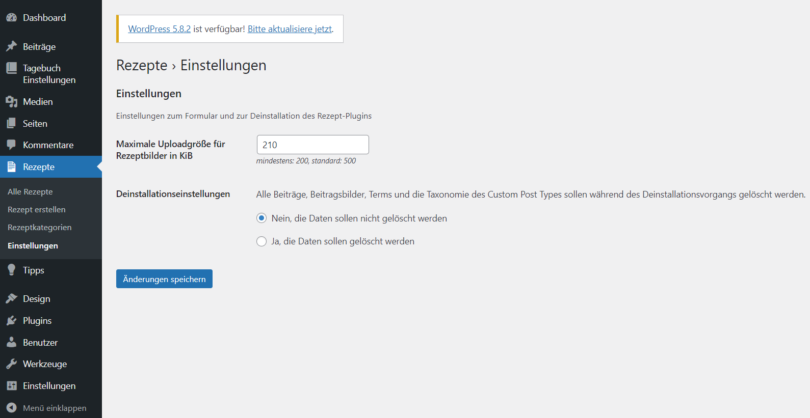
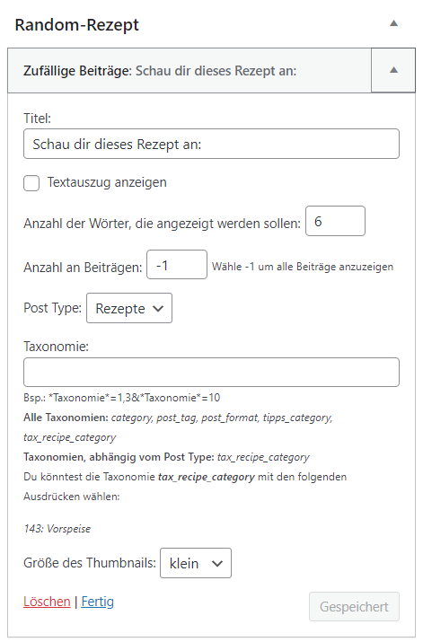
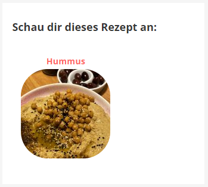
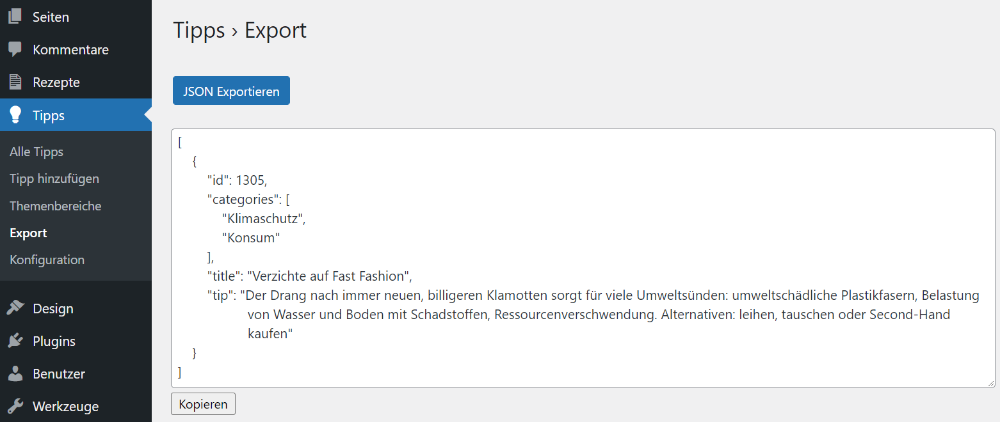

# WordPress Plugins

Im Rahmen eines Studienprojektes habe ich mit drei Kommiliton*innen eine WordPress-Website erstellt. Unsere Website heißt NAKT, ein Akronym basierend auf den Anfangsbuchstaben unserer Vornamen. Das Thema unserer Website war Nachhaltigkeit.  
Ich war für die Programmierung eines Rezepte Plugins und eines zufälligen Beitrag Widgets verantwortlich. Zusätzlich habe ich ein Plugin durch eine Exportfunktion erweitert. Auch auf die Lokalisierung habe ich geachtet. Sämtliche Inhalte können auf Deutsch und Englisch übersetzt werden, hierfür habe ich Poedit verwendet.  
Der in diesem Repository einsehbare Code wurde ausschließlich von mir programmiert. In den Ordnern *recipe-cpt* und *tipps* fehlen jeweils Dateien, da in diesen, externer Code enthalten wäre. Das zufällige Beitrags Widget (*random-post-widget*) ist komplett vollständig.

## Übersicht

Die Kompetenzen, die ich durch dieses Projekt erworben habe, lassen sich wie folgt zusammenfassen:
+ [**Plugin – Rezepte**](#rezepte-plugin)
    + Shortcode (Formular)
    + Frontend-Formular (Rezepterstellung)
    + User-generated content (Rezepte einreichen über Frontend-Formular)
    + Erweiterung der Template Hierarchie (Single Post Template)
    + Erweiterung des Customizers
    + Custom Post Type (Rezepte)
    + Einsatz von Medien (Upload eines Rezeptbildes als Anhang; Einbinden von Bildern und Videos in die erstellten Seiten)
    + Metadaten (Custom Taxonomy, WP Options)
    + WPDB (Löschen von Taxonomie und Terms)
    + Backend-Erweiterung (Metaboxen für die Rezeptdaten, Plugin-Einstellungen, Export)
    + AJAX
+ [**Widget – Zufällige Beiträge**](#zufälliges-beitrags-widget): Konfiguration 
+ [**Sonstiges**](#json-export-im-tipps-plugin)
    + Content-Selection (WP_Query: Export-Funktion und Widget)
    + JSON als Export-Format (Backend Tipps Plugin)

## Rezepte Plugin

Da die Ernährung einen großen Einfluss auf die Nachhaltigkeit des eigenen Lebensstiles hat, durfte diese bei unserer Website nicht zu kurz kommen.
Deshalb gibt es die Möglichkeit selbst Rezepte anzulegen, wobei es auch der besuchenden Person möglich ist, Rezepte einzureichen.
Über den **Shortcode** `recipe_form` lässt sich ein **Frontend-Formular** einbinden. Somit kann ein Rezeptbeitrag über das Formular im Frontend, wie auch über das Backend erstellt werden. Mittels **Custom Single Post Template** werden einzelne Rezeptbeiträge angezeigt. Die Darstellung der Beiträge kann unter Verwendung des **Customizers** angepasst werden. Als Administrator kann man im Backend außerdem die maximale Größe des Beitragsbildes in KiB anpassen, wodurch sich auch der Wert im Formular ändert. Zudem kann er bestimmen was bei einer Deinstallation des Plugins gelöscht werden soll.

### Installation

Um das Rezepte-Plugin nutzen zu können, muss man in den Ordner */wp-content/plugins* navigieren und dort den Plugin-Ordner *recipe-cpt* platzieren. Es erscheint dann im Backend unter dem Menüpunkt *Plugins*. Beim Aktivieren (bzw. auch beim Deaktivieren) werden die Rewrite-Rules aus dem Cache geleert, damit der\*die Nutzer\*in dies nicht manuell tun muss.

### Frontend Formular

Damit jedes Rezept einem Account zugeordnet werden kann, muss der Besucher der Webseite angemeldet sein, um ein Rezept einzureichen. Die **Formularfelder** für den **Rezeptnamen**, das **Bild**, die **Zutaten** und die **Zubereitung** sind verpflichtend, da dies essenzielle Bestandteile sind, die einen Rezeptbeitrag ausmachen. Der Text, der bei fehlender Eingabe im entsprechenden Pflichtfeld ausgegeben wird, wurde individuell an den Inhalt angepasst. Neben der fehlenden Eingabe wird bei einem Bild auch überprüft, ob jenes die maximale Upload-Größe überschreitet oder das passende Format hat.  
Damit das Formular nicht neu geladen werden muss und um zu verhindern, dass bei einer Fehlermeldung, die vom Besucher der Webseite bereits eingegebenen Daten gelöscht werden, wurde **Ajax** genutzt. Die Eingabefelder werden bei einer Fehlermeldung nicht geleert. Nur wenn der Beitrag gespeichert wurde, kommt es zu einem zurücksetzen der Felder, um zu vermeiden, dass dieselben Daten ein erneutes Mal gespeichert werden.

    

### Custom Post Type

Im Plugin wurde ein **Custom Post Type** genutzt, da diese die Verwaltung der Webseiteninhalte deutlich vereinfachen und dem Entwickler die Möglichkeit bieten die Bearbeitungsoberfläche, um Metaboxen für spezifische Daten zu erweitern und die Option bieten die Template Hierarchie von WordPress zu erweitern.
Um die Rezepte in **Kategorien** zu unterteilen wurde eine **Custom Taxonomy** erstellt. Außerdem konnten die **Rezeptbilder als Anhang** gespeichert werden und **Metaboxen** zum Verwalten der Rezeptdaten genutzt werden. Um die Rezeptbeiträge der WordPress Datenbank hinzuzufügen, wurde die Funktion `wp_insert_post()` verwendet. Da der Post Status auf pending gesetzt ist, werden Beiträge erst veröffentlicht, wenn eine Person mit entsprechender Berechtigung, diese auch veranlasst.

    

### Single Post Template und Customizer

Um einzelne Beiträge anzeigen lassen zu können, wurde ein **Custom Single Post Template** `single-cpt_recipe_form.php` erstellt. Die Erweiterung des **Customizers** ermöglicht ein einfaches Anpassen der Beitragsfarben. 
Um für eine einheitliche Schreibweise trotz Benutzereingabe zu sorgen, wurde die Option ergänzt, den Titel zu transformieren.

    

### Einstellungen

Das Plugin beinhaltet eine Einstellung, die das Frontend und eine die das Backend betrifft, beide sind durch den Administrator anpassbar. So kann man unter *Einstellungen* die maximale **Upload-Größe für Rezeptbilder** in KiB festlegen. Die gewählte Größe, wird dann auch im Formular angezeigt, sollte jemand also ein Bild hochladen wollen, welches diese Größe übersteigt, wird eine Fehlermeldung ausgegeben. Zudem kann der Admin auswählen, ob beim **Deinstallationsvorgang** des Plugins Beiträge, Beitragsbilder, Terms und die Custom Taxonomy gelöscht werden sollen oder nicht. Die Default-Werte werden in der Haupt-Plugin-Datei `recipe-cpt.php` festgelegt.

    

### Deinstallation

In der `uninstall.php` werden entweder nur die Optionen gelöscht oder (falls selektiert) auch die Beiträge, Beitragsbilder, Terms und die Custom Taxonomy. Jene Optionen werden unabhängig davon was der\*die Nutzer\*in selektiert hat gelöscht, damit er nach eventuell erneuter Installation des Plugins die **Standardeinstellungen** vorfindet.

## Zufälliges Beitrags Widget

Dieses Widget ist dafür da, Beiträge per Zufall anzuzeigen. Es kann z.B. im Dashboard zum Einsatz kommen, um dem Besucher der Seite Rezepttipps an die Hand zu geben. Die **minimalistische Anzeige eines Beitrags** sollte dann auf den richtigen Beitrag verlinken. Die **Konfigurationsmöglichkeiten** umfassen Titel, Post Type, Thumbnail-Größe, Taxonomie- bzw. Term-Auswahl und Anzahl der anzuzeigenden Beiträge. Zusätzlich gibt es auch die Option, einen kurzen Textausschnitt anzeigen zu lassen und die Wortlänge festzulegen.

    
    

### Titel, Beitragsanzahl, Post Type, Thumbnail-Größe, Textauszug

Der **Titel des Widgets** ist beliebig anpassbar, wobei es für den Titel, wie auch für alle anderen Konfigurationsmöglichkeiten einen Default-Wert gibt, der standardmäßig angezeigt wird. Außerdem kann selektiert werden, **wie viele Beiträge** auf einmal angezeigt werden sollen und welchem **Post Type** diese zugeordnet sein sollen. Auch die **Größe des Thumbnails** ist anpassbar. Unter Verwendung der Option einen **Textauszug** anzeigen zu lassen, wurde das Widget nicht nur dazu verwendet, Rezepte mit dem jeweiligen Beitragsbild anzuzeigen, sondern auch um Nachhaltigkeitstipps ausgeben.

### Taxonomie

Um die `WP_Query` auf **Taxonomien** beziehungsweise die dazugehörigen **Terms** filtern zu können, wurde die Konfigurationsmöglichkeit, alle gewünschten Taxonomien und Terms mittels Eingabefeld spezifizieren zu können, hinzugefügt. Dafür muss der\*die Nutzer\*in lediglich den Namen der Taxonomie angeben und diesem der entsprechenden ID zuweisen. Hier wurde sich dazu entschieden, ein Eingabefeld zu nutzen, um für Flexibilität im Hinblick auf die **Filterung** von Taxonomien und Terms zu sorgen. So kann am Beispiel des Rezepte Custom Post Types nach Vorspeise, Hauptspeise und Süßspeise gefiltert werden, sodass dem Besucher der Webseite eine Art Menü vorgeschlagen werden kann.  
Um dem\*der Nutzer\*in die Konfiguration des Widgets zu vereinfachen, sollte zunächst angezeigt werden, wie die Syntax für das Eingabefeld ist. Außerdem sollten alle Taxonomien, die auf seiner Seite zu finden sind, angezeigt werden, wie auch die Taxonomien, die dem selektierten Post Type zugeordnet werden können. Abschließend sollten auch die **Term IDs** angezeigt werden, damit der der\*die Nutzer\*in diese nicht extra suchen muss. Hierbei war es wichtig nur jene anzeigen zu lassen, die auch mindestens einem Beitrag zugeordnet werden können.

## JSON-Export im Tipps Plugin

Im Backend wurde unter dem Menüpunkt *Tipps* ein Untermenüpunkt *Export* eingerichtet. Klickt der\*die Nutzer\*in dort auf den Button zum Exportieren, werden ihm Daten der veröffentlichten Beiträge des Tipps Custom Post Types angezeigt. Die Beiträge werden mittels `WP_Query` durchlaufen und jeweils **ID, Kategorie, Titel und Tipp im JSON-Format** ausgegeben. Falls der\*die Nutzer\*in diese Daten weiterverarbeiten möchte, kann er mittels **Kopier-Button** den gesamten Inhalt des Textfeldes kopieren.

    

